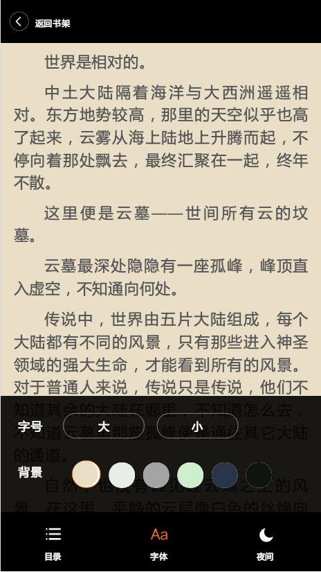

# 基于Echo、Go、Vue: 阅读书城

> 技术栈：vue + golang + mgo + echo 

> 预览地址： [http://47.94.11.23/wuyue](http://47.94.11.23/wuyue)

> api地址：[https://code.aliyun.com/wukc/wuyue/](https://code.aliyun.com/wukc/wuyue/)

> 爬虫地址：[https://code.aliyun.com/wukc/wuspider](https://code.aliyun.com/wukc/wuspider)

> 前端说明: clone vue-reader, 修改了接口和数据处理： [https://github.com/tgxhx/vue-reader](https://github.com/tgxhx/vue-reader)

``` bash
#克隆项目
git clone https://code.aliyun.com/wukc/wuyue.git

cd wuyue/view

# 安装依赖
npm install

# 本地开发环境 访问http://localhost:8080
npm run dev

# 构建生产
npm run build

```

## 项目说明

## 功能
- [x] 首页推荐
- [x] 书籍详情
- [x] 相似推荐
- [x] 分类查看 
- [x] 阅读器 
- [x] 章节跳转
- [x] 更改字体
- [x] 更换主题
- [x] 夜间模式
- [x] 翻页浏览
- [x] 本地存储（存储每本书的阅读进度）
- [ ] 书架（待考虑）


## 项目截图



